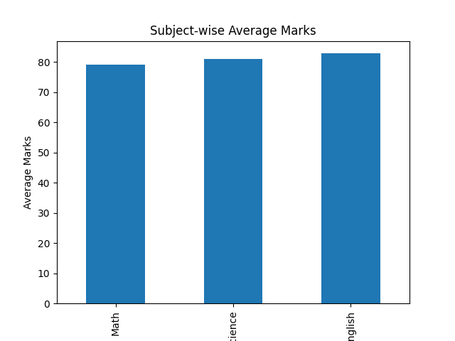

# 📊 Student Performance Analysis

## 📖 Project Overview
This project analyzes student academic performance using Python, Pandas, and Matplotlib.
The main objective is to calculate student averages, classify results as Pass/Fail, and visualize performance using bar charts.
This project demonstrates beginner-level data analysis skills.

## 🎯 Objectives
- Load and manage student data
- Calculate average marks
- Classify students as Pass or Fail
- Visualize performance using bar charts
- Understand basic data analysis workflow

## 🛠️ Technologies Used
- Python
- Pandas
- Matplotlib

## 📂 Project Structure
student-performance-analysis/
│── analysis.py  
│── output.png  
│── README.md  

## ⚙️ How It Works
1. Student marks are stored in a dictionary.
2. Data is converted into a Pandas DataFrame.
3. Average marks are calculated.
4. Pass/Fail classification is applied.
5. Bar chart is generated using Matplotlib.

## 🧠 Code Explanation
- `pd.DataFrame()` → Creates table structure
- `.mean(axis=1)` → Calculates average
- `lambda function` → Applies Pass/Fail condition
- `plt.bar()` → Creates bar chart

## 📊 Features
✔ Average Calculation  
✔ Pass/Fail Classification  
✔ Data Visualization  
✔ Beginner-Friendly Code  

## 📷 Output

## 🚀 Future Improvements
- Add grade classification (A, B, C)
- Use CSV file instead of hardcoded data
- Add correlation heatmap
- Build dashboard using Streamlit

## 💡 Learning Outcomes
- Practical use of Pandas
- Basic data visualization
- Data manipulation
- Writing structured Python scripts
